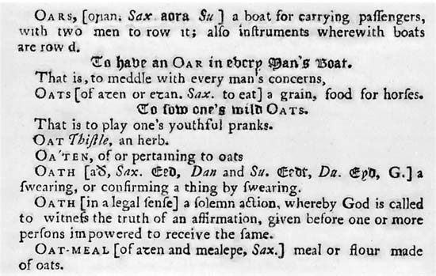
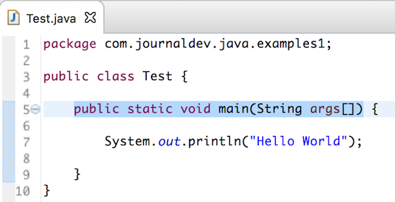
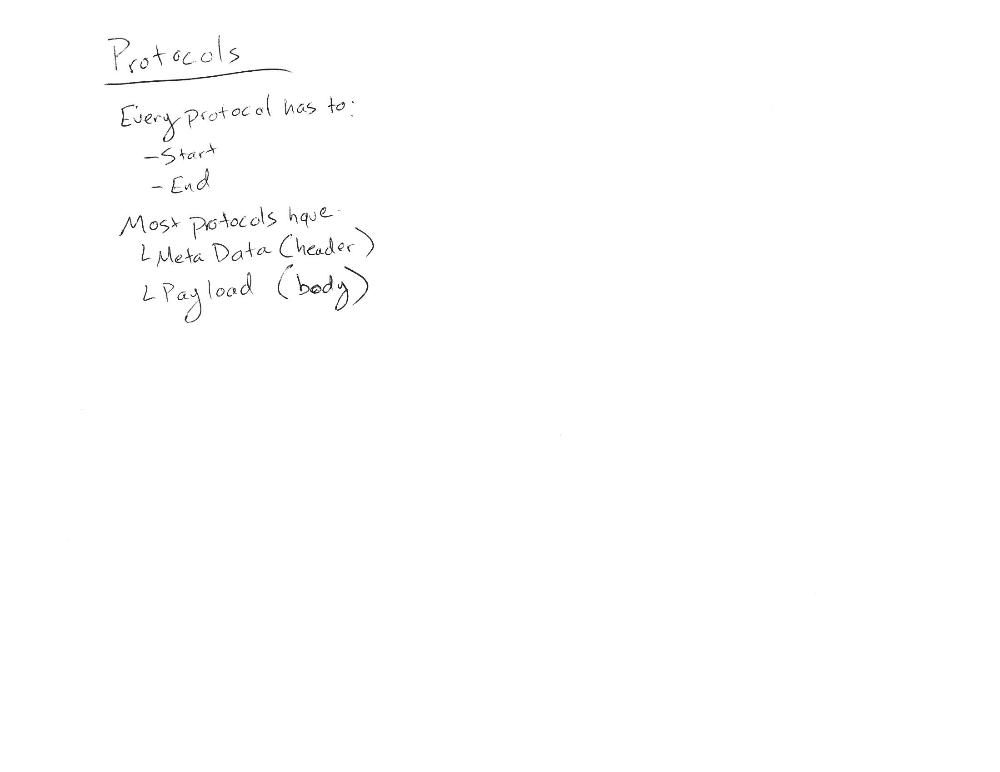

# Day 1

## Day 1 Outline

* Overview
* Protocol - from [OED](http://english.oxforddictionaries.com/protocol): "a set of rules governing the exchange or transmission of data between devices"
* Application Layer
* Start Coding

## Day 1 Resources

### Overview

* [Communication Networks Overview](https://com.ricks.io/Day1/)

### Protocols

#### Email
*

#### Letter

*

#### Dictionary

*

(Dictionary image from https://www.britannica.com/topic/dictionary/Kinds-of-dictionaries, retrieved 8/27/2019. Used due to the age of the dictionary and the threshold of originality. See https://en.wikipedia.org/wiki/Wikipedia:Image_use_policy#Public_domain)

#### Java Exmaple

* 

* Simple phone call

* TV Sitcom

* Film

* AD

* HTML

### In Class Notes

