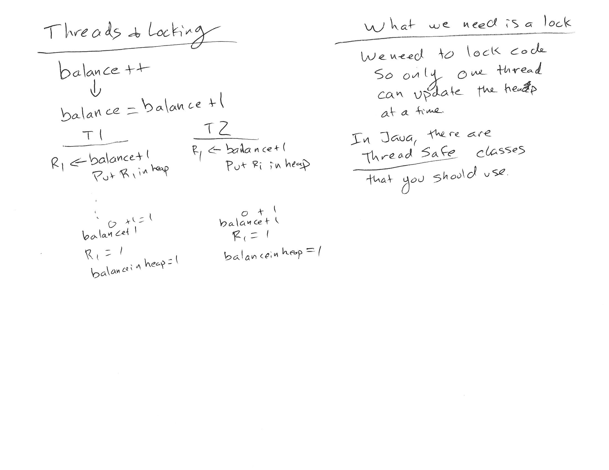

# Day 2 - HTTP

## Day Outline

* Day 1 Resources

* Syllabus

* Sprint-based course

* Distributed computing

  * Threads and Processes

* HTTP

## Resources

* Day 1

[Github Website](https://github.com/cs3550/Course)

[Threads and Processes](https://com.ricks.io/day2/)

[Threads Starter Code](https://github.com/CS3550/Threads)

[Socket Starter Code](https://github.com/CS3550/Sockets)

