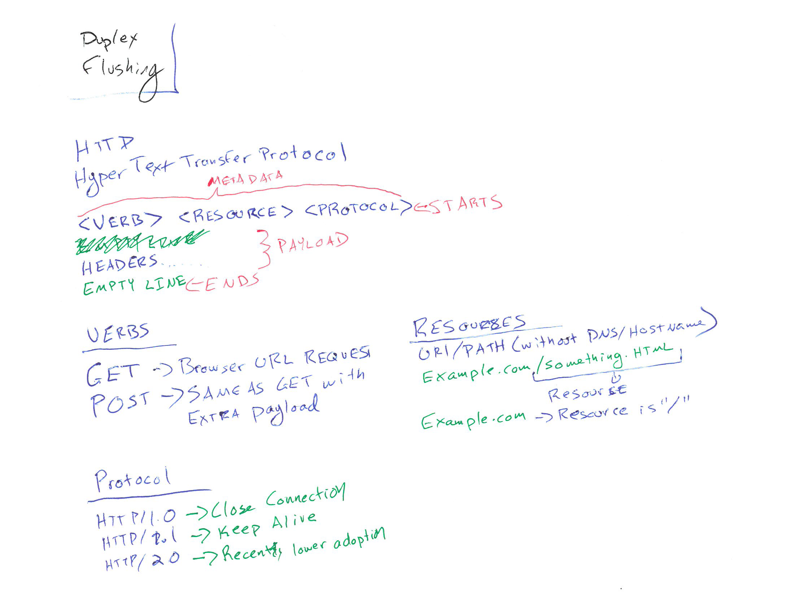

# Day 3 - Threaded Server

## Outline

* Setup up trello and signup for certain services
* Terms: [Simplex, Half Duplex, Full Duplex](https://en.wikipedia.org/wiki/Duplex_(telecommunications)), Flushing
* Convert server project to be threaded
* Have each thread echo back to the client
* Explore HTTP protocol

## Resources

* [Today's code](https://github.com/CS3550/ThreadedSocket)

### Handwritten Notes

