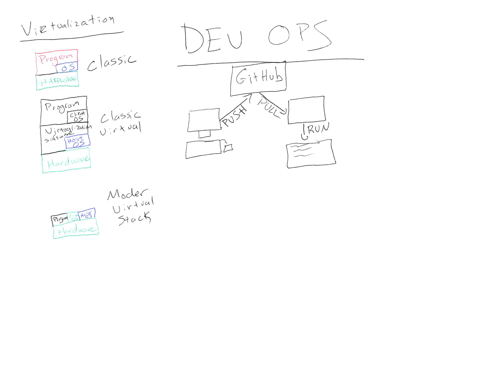

# Day 4 - HTTP Online

## Outline

* Sprint Prep
* More HTTP
* Out of the Nest
* Setup a box on Digital Ocean

## Resources

[HTTP Presentation](https://com.ricks.io/Day4)

### Understanding Virtualization

